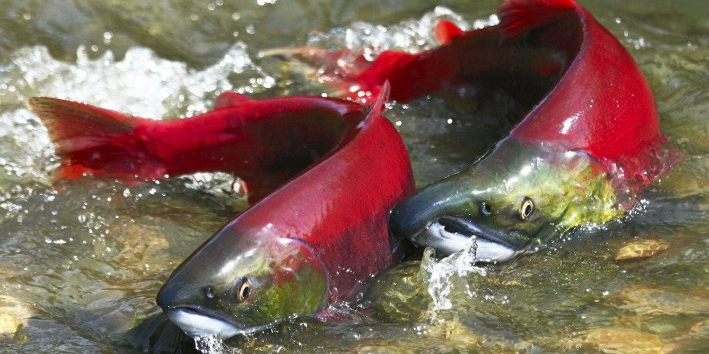
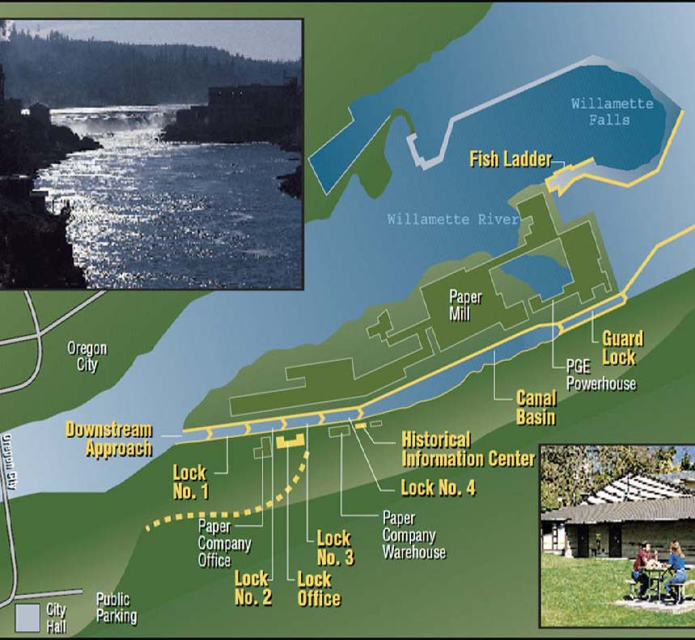

```{r setup, include=FALSE}
knitr::opts_chunk$set(echo = TRUE, message = FALSE, warning = FALSE)

library(tidyverse)
library(here)
library(lubridate)
library(tsibble)
library(feasts)
library(slider)
library(janitor)

```


```{r, echo = FALSE, results = 'markup'}

```

**Photo 1:** Columbia River Salmon Run, photo courtesy of: U.S Fish and Wildlife

```{r, echo = FALSE, results = 'markup'}

```

**Photo 2** Map of Willamette Fish Ladder, courtesy of US Army Corps of Engineers, Portland District

## **Overview:** 

This analysis examines  the patterns and seasonality of the passages of 3 salmon species: Steelhead, Coho, and Jack Coho in the Willamette Falls fish ladder location in Oregon. 

The overall data includes the dates from 2001-01-01 to 2010-12-31, and shows the record of passages for each fish in the river. We decided to focus on three salmon species (Steelhead, Jack Coho, and Coho) to analyze time series patterns. We first explored the pattern of the passages for each observed species using an original time series, next we created a season plot to explore any seasonality within each species' passages, and finally we included the total annual passage counts for each salmon species observed. 


**Data Source:** Columbia River DART (Data Access in Real Time), 2010. Data Courtesy of U.S. Army Corps of Engineers, NWD and Chelan, Douglas, and Grant County PUDs, Yakima Klickitat Fisheries Project, Colville Tribes Fish & Wildlife (OBMEP), Oregon Department of Fish & Wildlife, Washington Department of Fish & Wildlife.

## **Analysis:** {.tabset .tabset-fade .tabset-pills}

### Original Time Series 

```{r}
willamette_fish <- read_csv(here('data','willamette_fish_passage.csv')) %>%
  clean_names() # read in the data

## make subset of just steelhead, coho, and jack coho
willamette_salmon= subset(willamette_fish, select= c(date, steelhead, coho, jack_coho))

## replace NA's with 0 
salmon_tidy <- willamette_salmon %>% 
  replace(is.na(.), 0) 
  

```

```{r, eval = FALSE}
## exploratory ggplot to see any patterns
ggplot(data = salmon_tidy, aes(x = date, y = steelhead)) +
  geom_line()

```

```{r}
## convert to tsibble so it can be a time frame
salmon_ts <- salmon_tidy %>% 
  mutate(date = lubridate::mdy(date)) %>% 
  as_tsibble(key = NULL, index = date) %>% 

## use pivot longer to make all fish in one column
pivot_longer(cols = c(coho, jack_coho, steelhead),
               names_to = 'salmon_species',
               values_to = 'salmon_count') %>% 
# change names so it looks nicer
  mutate(salmon_species = case_when(salmon_species == 'coho' ~ 'Coho',
                                 salmon_species == 'jack_coho' ~ 'Jack Coho',
                                 salmon_species == 'steelhead' ~ 'Steelhead'))

## plot the data 
ggplot(data = salmon_ts, aes(x = date, y = salmon_count)) +
  geom_line(aes(color = salmon_species)) +
  scale_color_manual("Species",values = c("salmon","pink1","palevioletred4")) +
  labs(x = "Date (years)" , 
       y ="Salmon Passage Counts", 
       caption = " The figure shows passages through time (years) for three types of salmon: Steelhead, Coho, and Jack Coho.") +
  ggtitle("Figure 1: Time Series Analysis of 3 Salmon Species")

```

**Time Series Analysis:**

From looking at Figure 1, the following trends/patterns show:

- There are more passages toward the middle of the year for Steelhead salmon, and there are more passages toward the end of the year for Coho Salmon.

- Steelhead salmon have the highest peak passages from 2001 to 2008. From 2008 to 2011, Coho Salmon have the highest peak passages

- Jack Coho have the smallest peak passages, but their passage patterns are more similar to Coho than Steelhead


### Season Plot 

```{r}
#create seasonality plot for each salmon
salmon_ts %>% 
  gg_season(y = salmon_count) +
  labs(x = "Month", 
       y = "Salmon Passage",
       caption= "This graph shows the seasonality distribution between 3 salmon species: Coho, Jack Coho, and Steelhead") +
  ggtitle("Figure 2: Season Plot of 3 Salmon Species ")
  
```


**Season Plot Analysis:**

From this graph, several patterns and trends show:

- Steelhead Salmon have the most widely distributed seasonality, from January to the end of September

- Coho and Jack Coho passage seasonality peak at around September to October

- The year of peak passage for Coho Salmon is 2010, while peak passage for Jack Coho occurred in 2008, and peak passage for Steelhead occured in 2004

### Annual Counts by Species 

```{r}
salmon_counts <- salmon_tidy %>% 
mutate(date = lubridate::mdy(date)) %>% #change dates
mutate(year = year(date)) %>% #create year column
  pivot_longer(cols = c(coho, jack_coho,steelhead),#create a column for all species and counts
               names_to = 'salmon_species',
               values_to = 'passage_count') %>% 
mutate(salmon_species =case_when( #change names to a nicer format
  salmon_species == 'coho' ~ 'Coho',
  salmon_species == 'jack_coho' ~ 'Jack Coho',
  salmon_species == 'steelhead' ~ 'Steelhead')) %>% 
group_by(year, salmon_species) %>% #group by year and salmon species to get counts for each species
summarize(yearly_count =sum(passage_count)) #count sum of passages by year

```

```{r}
#plot the results!
ggplot(data = salmon_counts, aes (x = year, y = yearly_count)) +
  geom_line(aes(x = year, y = yearly_count, color = salmon_species)) +
  scale_color_manual("Species",values = c("salmon","pink1","palevioletred4")) +
  scale_x_continuous(breaks = c(2001, 2003, 2005, 2007, 2010)) +
  labs(x = "Year", 
       y = "Salmon Counts",
       caption = "This plot shows annual counts for 3 salmon species from 2001 to 2010 at Willamette Falls location") +
  ggtitle("Figure 3: Annual Counts for 3 Salmon Species at Willamette Falls, OR")
  
```


**Annual Counts Analysis**

From Figure 3, certain trends and patterns show:

- Jack Coho counts had the least variability throughout time

- Steelhead salmon had the highest counts overall except for  2009 when Coho had the highest counts


